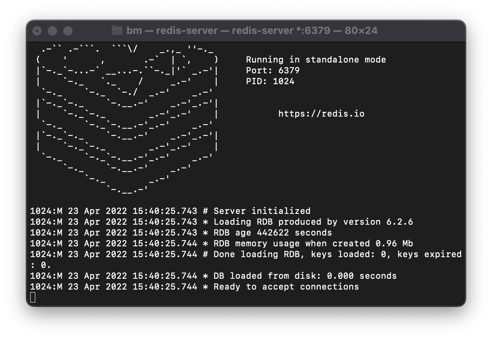
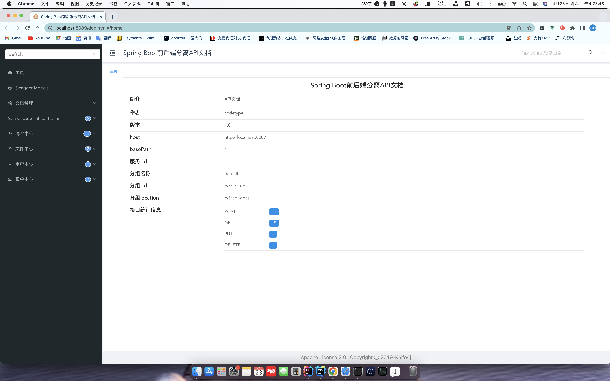
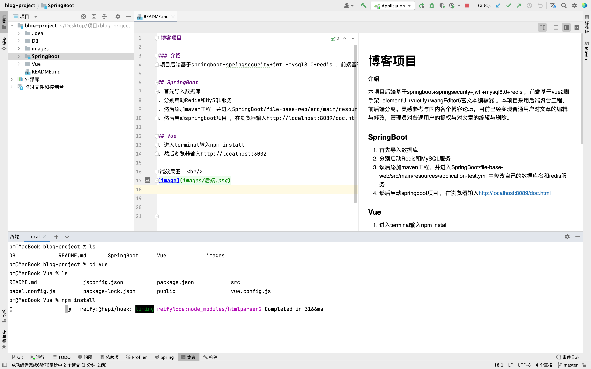
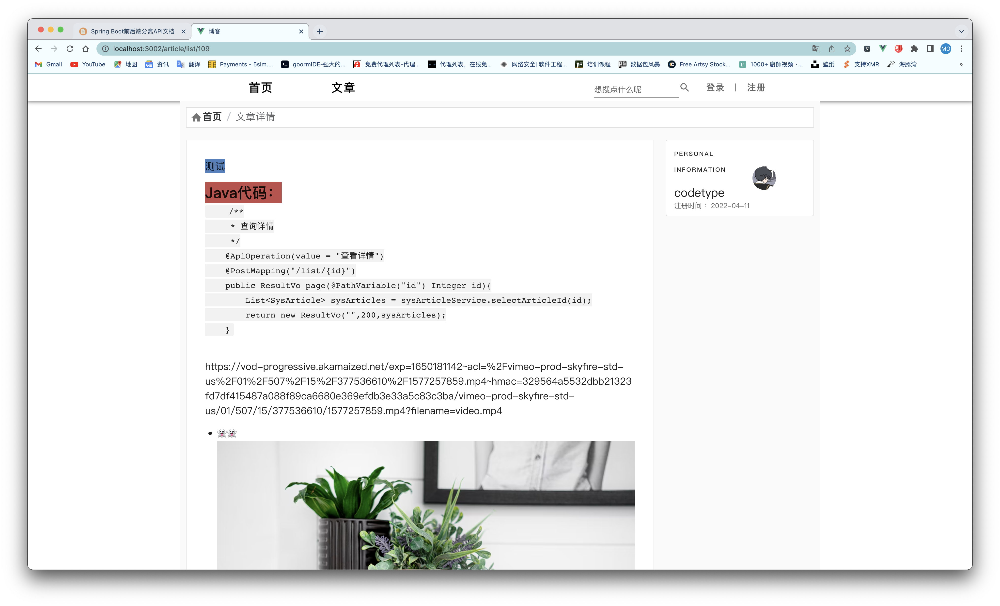
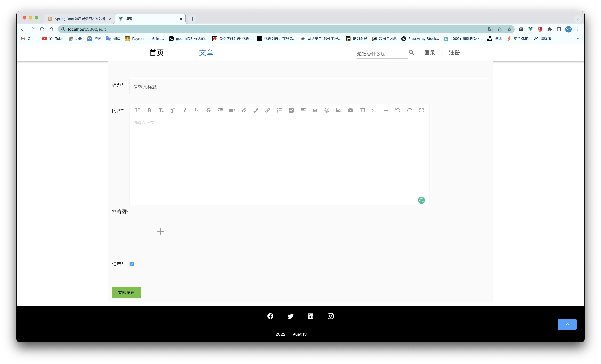

# 博客项目

#### 介绍
本项目后端基于springboot+springsecurity+jwt +mysql8.0+redis ，前端基于vue2脚手架+elementUI+vuetify+wangEditor5富文本编辑器 。本项目采用后端聚合工程，前后端分离。灵感参考与国内各个博客论坛，目前已经实现普通用户对文章的编辑与修改，管理员对普通用户的提权与对文章的编辑与删除。

### SpringBoot
1. 首先导入数据库
2. 分别启动Redis和MySQL服务
   
3. 然后添加maven工程，并进入SpringBoot/file-base-web/src/main/resources/application-test.yml 中修改自己的数据库名和redis服务
   
4. 然后启动springboot项目 ，在浏览器输入http://localhost:8089/doc.html
   
### Vue
1. 进入terminal输入npm install
   
2. 然后浏览器输入http://localhost:3002
   

后端效果图   

前端效果图   

<h2>有问题可以联系作者一起学习(在校大学生一枚)</h2>

<h2>一个人开发不易，若对你有帮助也可以请作者喝茶</h2>

 

